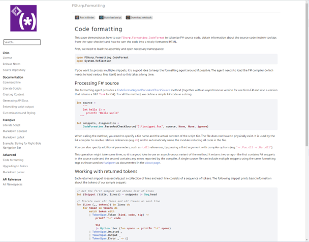
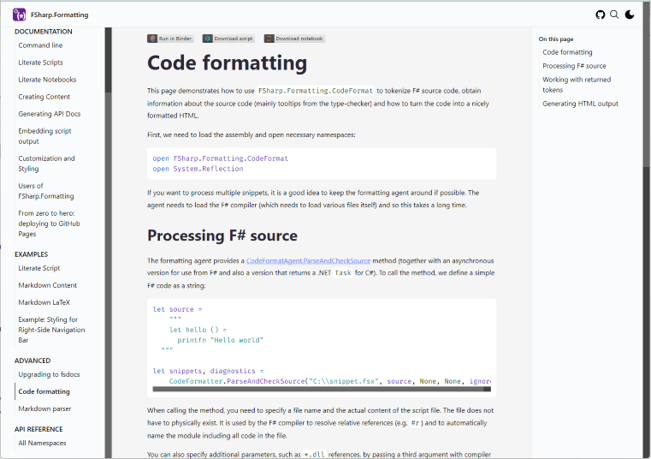

Stumbling upon new software can either be a moment of revelation or a cool find. Whether it's a solution to a lingering issue or just something that catches your eye, a positive initial impression sparks an urge to dive deeper. The immediate follow-up question usually is, _"Alright, how do I get this thing to work?"_ And that's when you cross your fingers, hoping for a treasure trove of documentation.

The absence of documentation is a deal-breaker, sure. But what also doesn't help is documentation that seems to have time-traveled from the early '90s. Modern-looking docs don't just make things easier to read; they signal that the project is alive and kicking. Enter [FSharp.Formatting](https://fsprojects.github.io/FSharp.Formatting/), the F# community's darling for documentation. With its [latest release, version 20](https://github.com/fsprojects/FSharp.Formatting/blob/main/RELEASE_NOTES.md#2000---2024-02-14), it's undergone a major facelift, and we're here for it.

## Going back to basics

The conversation in [issue #849](https://github.com/fsprojects/FSharp.Formatting/issues/849) highlighted a consensus: the old theme was laden with outdated practices and dependencies. It was high time for a revival, one rooted in the basics of HTML, CSS, and JavaScript.

Before:

After:

### Embracing Modern Web Standards

Crafting web pages is a delightful diversion for me, especially after wrestling with compiler codebases. It's almost therapeutic. I've honed my skills as a CSS craftsman, exploring the depths of what modern CSS offers. Features like nesting and variables are just the tip of the iceberg.

## Customizable Theming

The new theme is designed with customization in mind. Flipping a few CSS variables allows for extensive personalization, tailoring the look and feel to match any project's aesthetic. Check out the guide on [overriding CSS variables](https://fsprojects.github.io/FSharp.Formatting/styling.html#CSS-variables) for more details.

Some standout custom themes:

- [Fantomas](https://fsprojects.github.io/fantomas/docs/)
- [Telplin](https://nojaf.com/telplin/docs/)
- [G-Research FSharp Analyzers](https://g-research.github.io/fsharp-analyzers/)
- [vite-plugin-fable](https://nojaf.com/vite-plugin-fable/)

## Fostering Community Dialogue

This update has ignited valuable discussions within the community. Special thanks to [Kevin Frey](https://github.com/Freymaurer), [Kevin Schneider](https://github.com/kMutagene), and [Nicolas Hirschey](https://github.com/nhirschey) for their insights and feedback.

We've **engaged in conversations** both online and in person, reinforcing **the importance of direct communication**. Establishing a real connection with your collaborators enhances all future interactions and is a cornerstone of a positive open-source journey.

## Dive In

Give the [new release](https://www.nuget.org/packages/fsdocs-tool/20.0.0) a whirl and step up your documentation game. Let's keep our docs as sharp and modern as our code!
