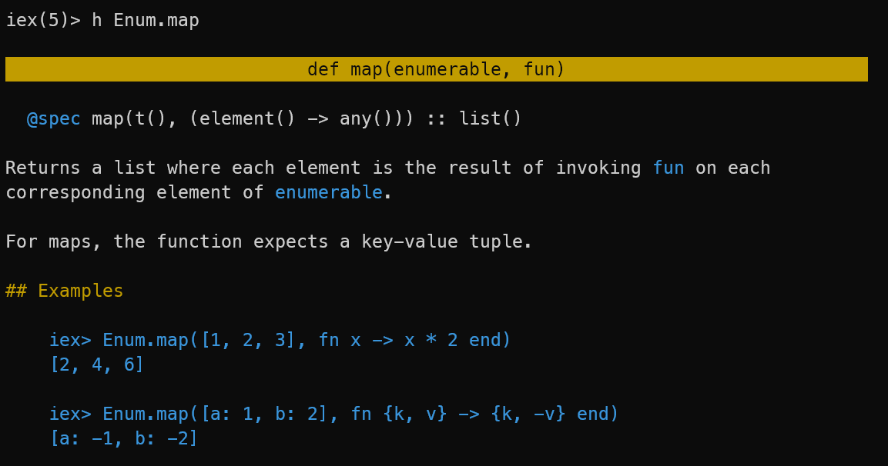

For various reaons I have been looking into other FP languages and communities recently.  
One of the languages was [Elixir](https://elixir-lang.org/), which is a functional language on top of the [BEAM VM](<https://en.wikipedia.org/wiki/BEAM_(Erlang_virtual_machine)>). A piece of technology that has me in total awe.
As shown in one of our previous [sessions](https://www.youtube.com/live/8aBmGUNFBQI?si=JD-exm6rO_J38mG_&t=893), I noticed that the Elixir REPL (iex) has a very nice feature, the `h` function.
Want to know more about a function? For example, `Enum.map`? Just type `h` followed by the function name and you get a nicely formatted help text:



That's a really cool feature, especially for beginners. You can stay in the REPL and get help on the fly. No need to switch to a browser and search for the function. No context switch for your brain. No interruption of your flow.

Seeing that, I wondered if we could do something similar for F#, to help it's REPL (fsi) to keep up with the competition and become as beginner friendly as iex.  
With the XML documentation that is already available for .NET, it should be possible to create a similar help function for F#.  
As I wasn't exactly filled with joy looking forward to writing a parser for the XML documentation, I pondered some other approaches first.  
Going directly to the source code files or using the output of [FSharp.Formatting](https://github.com/fsprojects/FSharp.Formatting) were two options that came to mind.  
But it became clear pretty quickly that the XML files that are distributed with .NET assemblies would be the way to go.  
No network access required, no need to crack project files to parse source code files to find the correct lines, no need to parse HTML, no big dependencies.

Elixir treats documentation as a first class citizen. Thus, it's part of the bytecode, aka the `.beam` files, that is generated by the compiler.
In .NET, documentation is not part of the bytecode. Instead, it is stored in XML files that are distributed with the assemblies.
But how do we identify the assembly containing the function we are interested in? Of course, Reflection comes to mind. But how can we obtain the information needed by the Reflection API?  
For this, I settled with [Quotations](https://learn.microsoft.com/en-us/dotnet/fsharp/language-reference/code-quotations). There are active patterns available in FSharp.Core that let us extract the information we need from a quotation.  
Using quotations, some more doors suddenly open to us. More on that later. So with the path to the dll in hand, we can load the XML documentation file next to it, parse it and extract the information we need:


As you see, `h` gives you direct access to

- the description
- the remarks
- the parameters
- exceptions info
- and example code.

To not leave any details out, it also shows the FullName of the function and the containing assembly. Of course, we depend on the docs authors to provide all this information.

So what was the deal with Quotations? Using them lets us apply the `h` function to real language constructs, not just to function names. Try for yourself. Things like `h <@ fst ("foo", 23) @>` work just fine.

While the core documentation might be the most important part for newcomers, there is also the use case of exploring a new library within the REPL. And with the great feature of loading nuget packages on the fly, this is very common.  
Can `h` help us here as well?

Sure, just reference the nuget package and you are good to go:

```fsharp
#r "nuget: FSharp.Analyzers.SDK";;
h <@ FSharp.Analyzers.SDK.TASTCollecting.walkTast @>;;
// ...
```

To be independent of F# releases, I developed `h` as a standalone [nuget](https://www.nuget.org/packages/Fsih/) package.  
It's just a

```fsharp
#r "nuget: Fsih";;
open Fsih;;
```

away.

When things have calmed down a bit, I might look into integrating [Fsih](https://github.com/dawedawe/fsih) into fsi, so that it is available without the need to reference a nuget package. Speaking of fsi improvements, there are lots of other things that could be done to improve the DX. Having profiles and a history like other shells, auto loading of nuget packages at startup are obvious next steps.  
Maybe next years F# advent will have some more news on that ;)

Until then, I wish you all some chill days and a happy new year!
