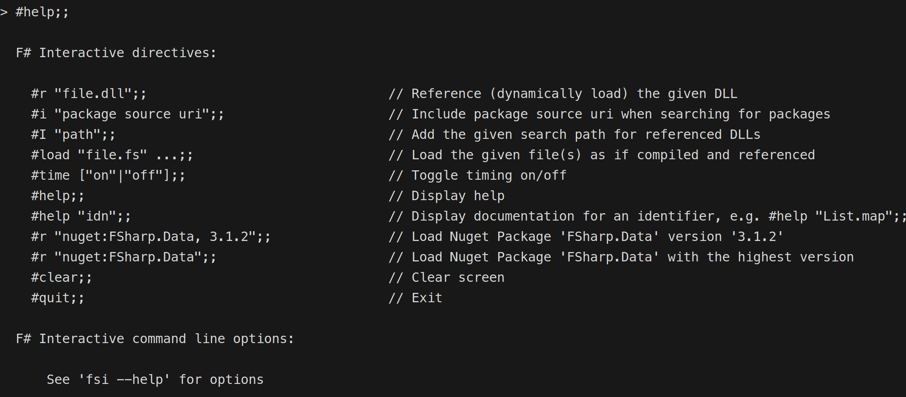
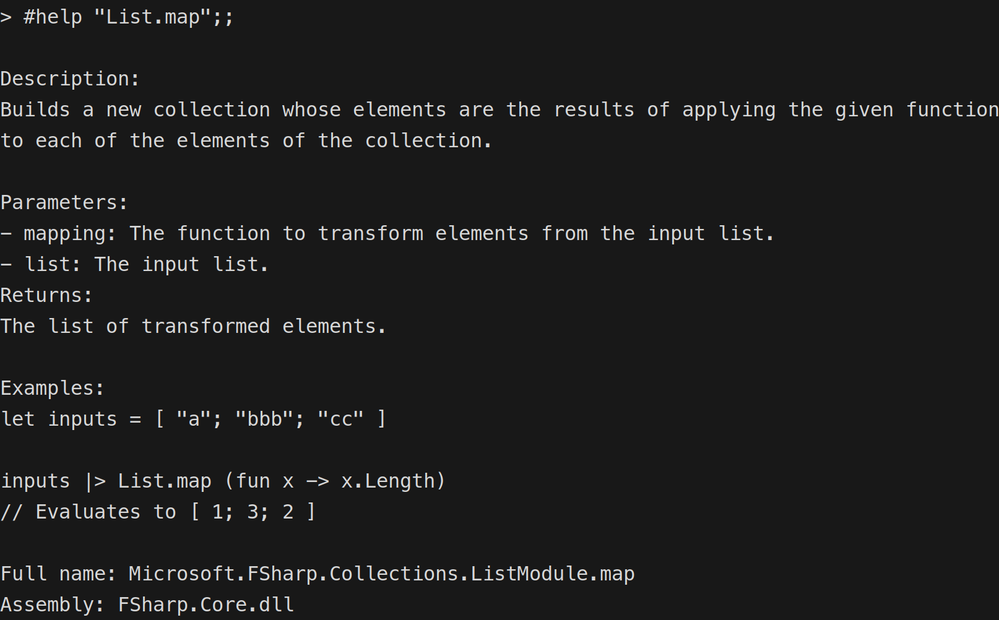
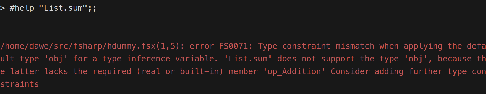
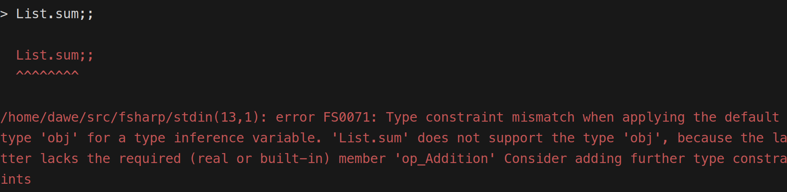
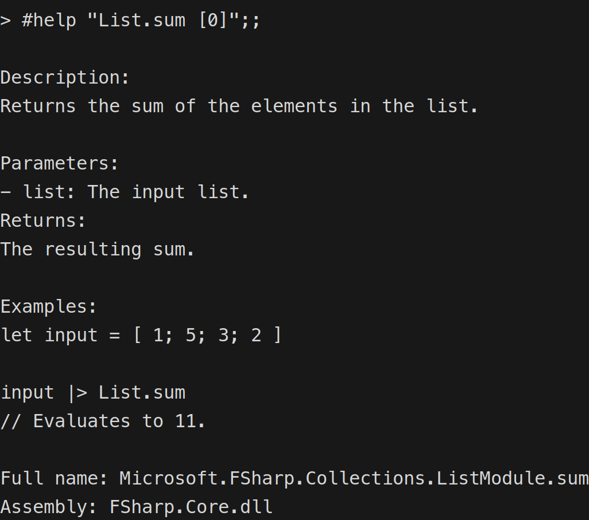

Some of you might remember our [Unlocking F# Potential](https://amplifyingfsharp.io/sessions/2023/11/24/) session from last November when I showed the first prototype of [fsih](https://github.com/dawedawe/fsih). A small package modelled after the `h` function of the Elixir [IEx](https://hexdocs.pm/iex/1.16.0/IEx.html) REPL to have documentation availabe at your finger tips without the need to context switch to a browser.
The feedback I got was very encouraging, I released the package and blogged about it in the [F# Advent](https://amplifyingfsharp.io/blog/2023/12/25/).

The obvious thing to do was, of course, porting it to fsi itself to remove the hassle of referencing the package in every fsi session.
The first try was made during an Amplifying F# [session](https://amplifyingfsharp.io/sessions/2024/01/26/) back in January. For various reasons I wasn't able to finish it at that time. A second attempt was started last May, this time with the financial backing of the [Amplifying F# Open Collective](https://opencollective.com/amplifying-fsharp).

The [PR](https://github.com/dotnet/fsharp/pull/17140) sparked a good discussion how to make the functionality available to fsi users. My initial port used a new hash directive called `#h`. But as hash directives in fsi are parsed with the normal F# parser, that meant we had to wrap the expression in quotation marks, like `#h "List.map"`.

Brian proposed the idea of using a method in the `fsi` object that is available in every fsi session. This would allow us to use the method without the need for quotation marks, e.g. `fsi.h List.map`.
I liked the idea and made the necessary changes to the PR. In parallel, Kevin started to [work on the parser](https://github.com/dotnet/fsharp/pull/17206) to remove the need for quotation marks because he was in favor of reusing the existing `#help` hash directive for the new functionality. And as the main maintainer of fsi, his opinion was the most important one. So I adapted the PR again to use the `#help` directive. To my great joy, the PR was merged last week and will be available in a future release of the F# compiler.
For the time being, quotation marks are still needed while Kevins parser PR is not yet merged. But I'm confident that will happen soon.

So where does this leave us? In the future, when you invoke the `#help` directive in fsi, you will see a new entry `#help "idn"`:

And just as the screenshot suggests, you can use it like this:

Et voilà, the functionality you know from the fsih package in fsi without any additional dependencies. To keep things simple and to avoid bloating F#, the dependency of fsih on `Spectre.Console` was not ported over. The output is just uncolored plain text. A follow up PR might add some coloring with the built-in coloring capabilities.

It's possible to run into a type constraint issues when using the functionality with functions like `List.sum`:

You will see something similar when you just type `List.sum` to get the signature of the function:

You can still get the documentation by lending F# a helping hand to infer the type:

All in all, I'm quite happy with the result of the porting effort. It would not have been possible without the genorous supporters of the [Amplifying F# Open Collective](https://opencollective.com/amplifying-fsharp). So once again, I want to express my gratitude to all of you and to all reviewers of the PR.

If you want to see continuous improvements in the F# ecosystem, please consider supporting us financially. Every little bit helps.
