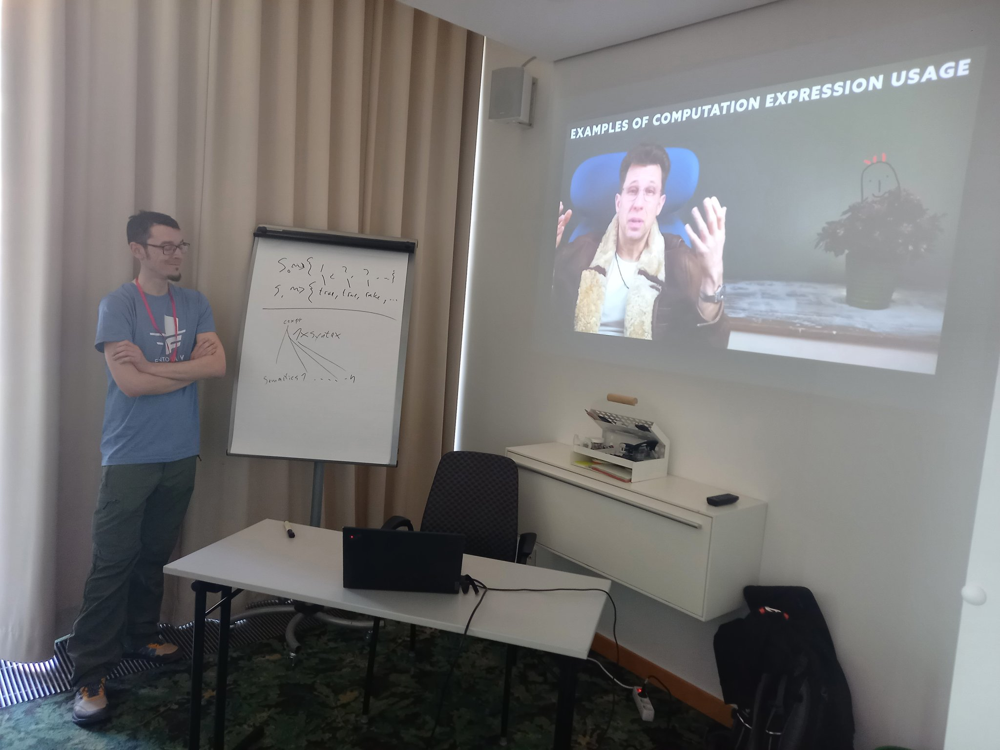

[BOBKonf](https://bobkonf.de/2024/en/) is a yearly conference in Berlin, Germany. It's target audience is more on the functional programming side of things, but it's not limited to that.

[Ronald](https://github.com/SchlenkR/) and me submitted a talk/tutorial about Computation Expressions in F#. For outsiders it's a hidden gem in the F# language and we wanted to share our knowledge about it and, of course, attract more people to F#. Our submission was [accepted](https://bobkonf.de/2024/schaefer-schlenker.html) and we spent quite some time preparing for it. [Edgar](https://github.com/edgarfgp) decided to join us and we were expecting a great time in Berlin.

Things kicked off with a big pre-conference [meetup](https://www.meetup.com/elixir-berlin/events/298731809/) with the Elixir/Clojure community of Berlin. I have to admit, seeing that many people in a functional community meetup made me a bit jealous. I hope we can get to a level like that with F# one day.

Unfortunately, [Ronald](https://twitter.com/SchlenkR) couldn't make it to Berlin in person, but he was able make up for it with an exclusive edition of his trademark [videos](https://www.youtube.com/@ThePureState). So I just played his video and from the feedback we got, it was well received.

Besides the slides for the talk, we also prepared some exercises for the attendees to learn the basics of builder type members and custom operations. Given that the attendees were coming from very different backgrounds, some interesting discussions quickly arose and it was nice to have Edgar there. Even though we were a small group, we had a great time during the 90 minutes. The content is available [here](https://github.com/dawedawe/bobkonf2024)

Edgar and me were delighted to run into [Luis](https://twitter.com/lamg__), who was only known to us from his social media presence so far.
We had a long conversation with [Sabine](https://twitter.com/sabine_s_) and [Leandro](https://twitter.com/leostera) from the [OCaml](https://ocaml.org/) community to share our AF knowledge with them and we are looking forward to what they will make out of it. The conference day ended with the post-conference dinner where we continued to make new friends and share our love for F#.

A spectial thank-you goes out to all contributors to our [collective](https://opencollective.com/amplifying-fsharp). Your money helped to make this trip possible. A big thank-you for the BOBKonf organizers is also in order. We decided to be regulars at this conference from now on.

