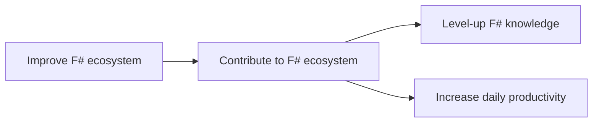

In practical terms, you should see this initiative as two things: educational and an attempt to improve daily productivity.

There is a lot you can learn from pair/mob programming with seasoned F# developers from all over the world.
The diversity of backgrounds can broaden your perspective and genuinely make you better at your job.

Being able to solve outstanding problems that hinder your day-to-day flow, will reward itself over time.

If you need more help to convince your boss, you can refer to our [incitation letter](#) or reach [out to us](#email) and we would happily chime in.
