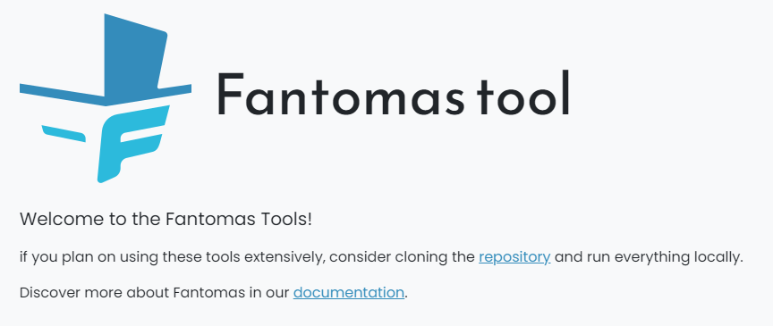

## Problem

[Fantomas tools](https://fsprojects.github.io/fantomas-tools/#/) is a comprehensive set of utilities designed for use when working on [Fantomas](https://fsprojects.github.io/fantomas/) or the [F# untyped AST](https://fsharp.github.io/fsharp-compiler-docs/reference/fsharp-compiler-syntax.html).  
The frontend is built using [Fable](https://fable.io/) &amp; [React](https://react.dev/), while the backend consists of a set of [AWS Lambda](https://aws.amazon.com/blogs/developer/f-tooling-support-for-aws-lambda/) functions.

These Lambda functions are an interesting way to keep the cost low, but they can take a while to start up.  
Therefore, the maintainers recommend running the tools locally to speed up the user experience.

The usual approach to frontend development is to install Node.js and bring a complex toolchain which sometimes requires you to understand how Node.js works and its ecosystem which can be a lengthy task.

## Expected behavior

Ideally for front-end development we should not need to know how Node.js or any other underlying tools work and the complexities they have, as we're only working in the client side, our focus should be the web itself.
[Perla](https://perla-docs.web.app/) is a modern development web server for front-end development written in `dotnet`.  
Because Perla is shipped as a `dotnet` tool, you only need to `dotnet` SDK to get started.

## Champion

- [Angel D. Munoz](https://twitter.com/angel_d_munoz)
